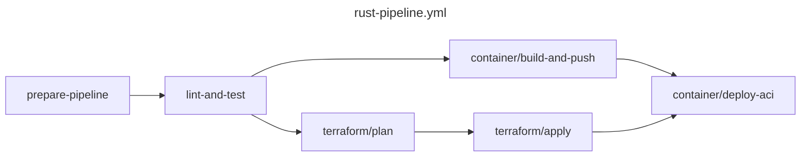

# github-actions

## Pipelines

### Rust pipeline

**Workflow file:** .github/workflow/rust-pipeline.yml

This workflow will lint and test the project. Then it builds a container and deploys it to a given platform. It also plans and apllies terraform changes.

